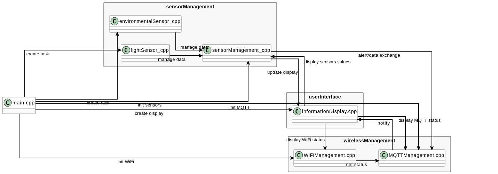

# MultiSensor

This is a measurement station project based on an `ESP32-C6` microcontroller.

## Project Structure and Code Organization

### 1. `sensorManagement/`
This folder contains all classes related to sensor management:
- **`environmentalSensor`**: Manages environmental measurements (temperature, humidity, pressure, gas/IAQ) using the BME680 sensor. Provides initialization, moving average filtering, and IAQ calculation. All sensor readings are encapsulated in this class.
- **`lightSensor`**: Manages ambient light measurement using the BH1750 sensor. This module is now a standard part of the project and provides real-time luminosity readings used for adaptive display brightness and energy-saving logic.

All sensor classes encapsulate hardware access and expose high-level methods for use in the main application or tasks. The `environmentalSensor` class is central for all environmental data, while the `lightSensor` class is dedicated to light measurements.

The file `sensorManagement.cpp` acts as the orchestrator for all sensor modules. It coordinates initialization, periodic data acquisition, threshold checks, and data aggregation. This centralization simplifies adding new sensors and ensures consistent data handling across the project.

### 2. `wirelessManagement/`
This directory contains classes for network connectivity:
- **`WiFiManagement`**: Handles WiFi connection, reconnection, and status monitoring. Provides a method to connect to WiFi and manages connection retries.
- **`MQTTManagement`**: Manages MQTT communication (publish/subscribe), serializes sensor data into JSON, and publishes it to a remote MQTT broker. Includes methods for broker connection, data serialization, and publishing.

These classes abstract the complexity of network protocols and provide simple APIs for the rest of the application. They use the ArduinoJson and PubSubClient libraries for JSON and MQTT support.

### 3. `userInterface/`
This folder manages user interaction and display:
- **`informationDisplay`**: Controls the I2C LCD display (16x2), including text output, backlight control, and custom characters. Provides methods to display sensor values (temperature, humidity, pressure, IAQ) and system messages. Includes rolling display logic to cycle through different sensor values.

All display logic is encapsulated in this class, making it easy to update or extend the user interface.

## Architecture overview

Below is a visual overview of the interactions between the main code modules (main, sensorManagement, wirelessManagement, userInterface). Render `architecture.puml` to produce the diagram image (e.g. `architecture.png`) and place it in the repository root. Example:

You can also view or edit the PlantUML source directly: `architecture.puml`.

## Current features

- Reads five physical quantities:
  - from the `BME680` I2C sensor
    - Temperature (°C)
    - Relative Humidity (%RH)
    - Atmospheric Pressure (hPa)
    - Gas / Indoor Air Quality (IAQ)
  - from the `BH1750` I2C sensor
    - Luminosity (lux)

- Uses a moving-average filter with a window of 6 samples (each sample taken every 5 minutes). At startup, the moving average is calculated only on the non-zero values present in the buffer, ensuring accurate averaging even before the buffer is fully filled.

- Publishes sensor measurements and status to a remote MQTT broker as JSON. Measurements are published every 5 minutes on the topic `Multisensor`, enabling logging, dashboards and automation systems to consume the data.

- Detects abnormal values using configurable thresholds and issues alerts when measurements exceed these limits. Alerts are published to the MQTT broker on the topic `Multisensor/threshold/name of the physical value`

- Displays current measurements and system status on the `I2C LCD (16x2)` for on-site monitoring. The display also shows connectivity status of Wi‑Fi and MQTT.

## Planned features / Roadmap

- Solar & Battery improvements: implement a solar charge controller strategy

- New sensors: plan to add wind speed and direction sensors (anemometer + wind vane), lightning/impact detection modules or UV detector to extend environmental monitoring.

- Threshold alert delivery change: threshold breaches will be batched and published together with the periodic data publication (every 30 minutes) instead of being sent immediately as asynchronous messages.

- Improved measurement precision: support for higher-precision sensor modules and calibration procedures to reduce measurement uncertainty and drift.

- Architectural separation: split the codebase into two clear modules:
  - Measurement module: sensor drivers, acquisition, moving-average aggregation, threshold checks and data publishing.
  - Display/UI module: presentation, local status/alerts and user interactions. 
  This separation improves modularity, testing and allows independent evolution of sensing and presentation logic.

